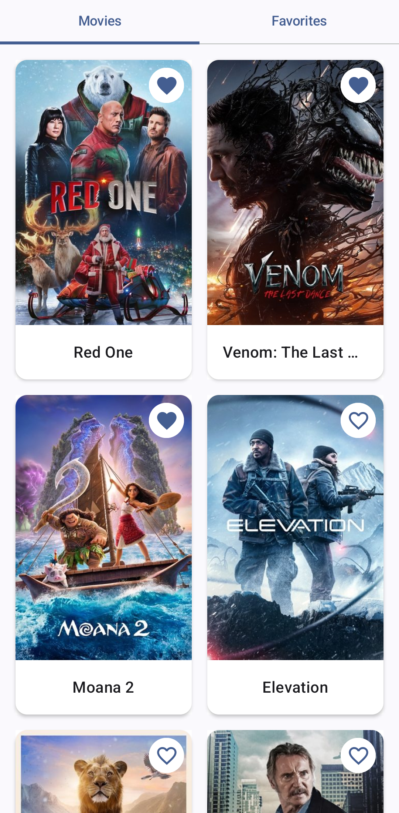
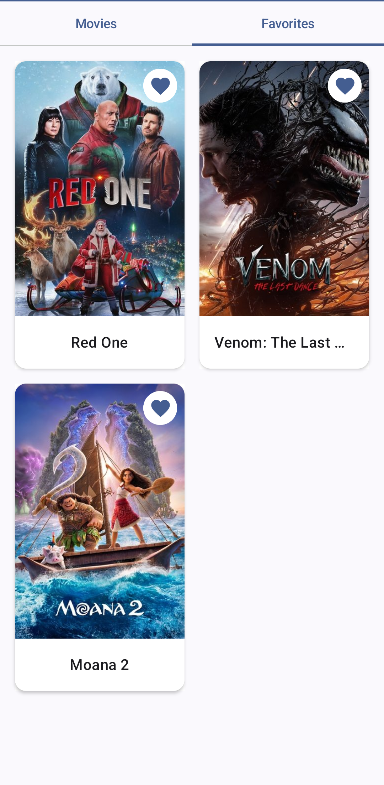
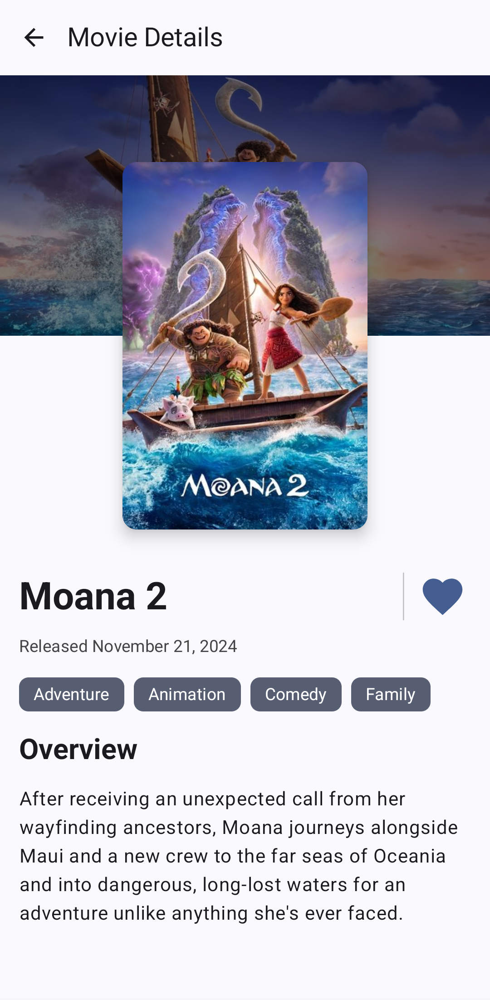

# Movies App

A modern Movies App developed using **Clean Architecture principles** to provide a seamless user experience and maintain scalability. The app showcases popular movies, allows users to save their favorites, and view detailed information about each movie. This app utilizes data from **The Movie Database (TMDB)**.

## Features
- **Movies Tab**: Browse a grid of popular movie titles with their posters.
- **Favorites Tab**: View and manage your favorite movies in one place.
- **Details Screen**: Explore detailed information about each movie, including its description, release date, and more.

## Screenshots
### Movies Tab


### Favorites Screen


### Details Screen


## Tech Stack
This app leverages the latest tools and libraries to ensure high performance and maintainability:
- **Jetpack Compose**: For building a modern, declarative UI.
- **Retrofit**: For seamless network requests to fetch movie data.
- **Kotlin Coroutines**: To handle asynchronous programming with ease.
- **Room**: For offline data persistence.
- **Coil**: For efficient image loading.
- **Hilt**: For dependency injection.
- **Jetpack Navigation**: To handle navigation between screens.

## Running the App Locally

To run the app locally, you need to provide your TMDB access token. Follow these steps:

1. Obtain your access token from the TMDB API page.
2. In your project root, create a file named `local.properties`.
3. Add the following line to the `local.properties` file:

   ```properties
   TMDB_ACCESS_TOKEN=[your_token_here]

4. After setting up the token, you can run the app locally.